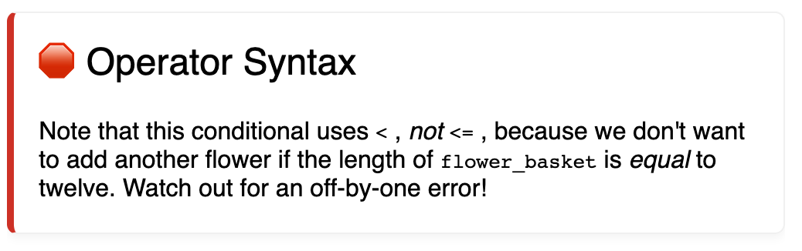

# Callouts
Callouts are marked by `!` start and end tags. Here are some examples of how they might be rendered:




These are created with the following markdown:

```md
### !callout-danger

## Operator Syntax

Note that this conditional uses `<` , _not_ `<=` , because we don't want to add another flower if the length of `flower_basket` is _equal_ to twelve. Watch out for an off-by-one error!

### !end-callout

### !callout-info

## `for` Loops

An alternative syntax is to use `for` loops with a range. The `for` loop syntax sets up and modifies something like a counter variable!

### !end-callout

```

# Callout Types
These are the known callout types:
* info
* success
* warning
* danger
* secondary
* star

We've implemented each of these except "star".